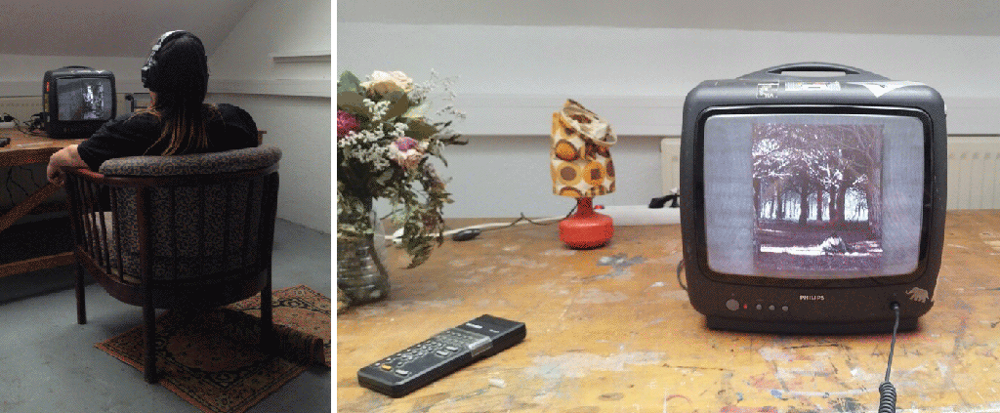

# Art Shelter: BlurHaven, aka `Floupocalypse`

"BlurHaven" is an immersive art installation for XUL 2024, set in a post-epidemic world where an enigmatic condition renders all life forms blurry, challenging our perceptions of reality and existence in a uniquely crafted shelter environment.

This repository contains the software and data (mostly digital photos) that was part of the installation. The software simulates a slideshow as if it was broadcasted on an analogic TV network. The code is written in Lua, running on the [HARFANG](https://github.com/harfang3d/) framework.

_Presented at [XUL 2024](https://xul.labomedia.org/floupocalypse-madmarie/) in Orléans._
